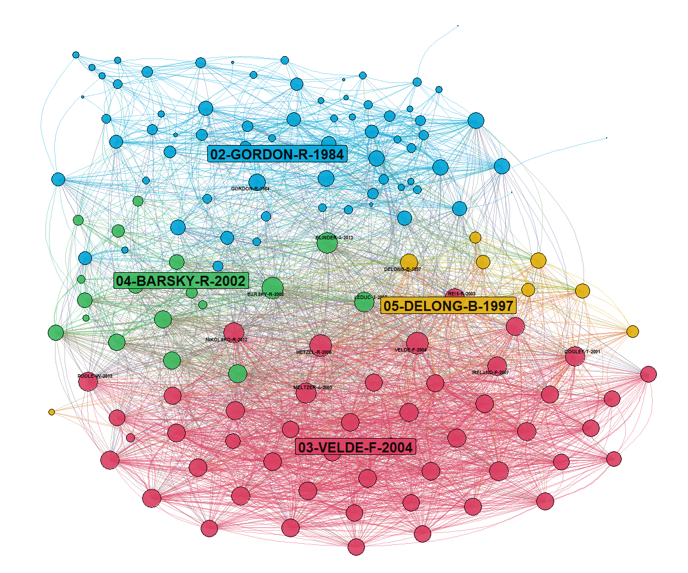

-   [networkflow](#networkflow)
    -   [Installation](#installation)
    -   [The workflow for networks](#the-workflow-for-networks)
        -   [First step: creating the network and keeping the main
            component](#first-step-creating-the-network-and-keeping-the-main-component)
        -   [Second step: finding
            communities](#second-step-finding-communities)
        -   [Third step: giving a structure to your
            graph](#third-step-giving-a-structure-to-your-graph)
        -   [Fourth step: projecting your graph, at
            last!](#fourth-step-projecting-your-graph-at-last)
    -   [References](#references)

<!-- README.md is generated from README.Rmd. Please edit that file -->

# networkflow

<!-- badges: start -->
<!-- badges: end -->

The goal of networkflow (a workflow for networks) is to propose a serie
of functions to make it easier and quicker to work on networks. It
mainly targets working on bibliometric networks (see the
[biblionetwork](https://github.com/agoutsmedt/biblionetwork) package for
creating such networks). This package heavily relies on
[igraph](https://igraph.org/r/) and
[tidygraph](https://tidygraph.data-imaginist.com/index.html), and aims
at producing ready-made networks for projecting them using
[ggraph](https://ggraph.data-imaginist.com/). This package does not
invent nothing new, properly speaking, but it allows the users to follow
more quickly and easily the main steps of network manipulation, from
creating the graph to projecting it. It is inspired by what could be
done with [GEPHI](https://gephi.org/): the package allows the use of the
Leiden community detection algorithm, as well as of the Force Atlas 2
layout, both being unavailable in igraph (and so in tidygraph).

## Installation

You can install the development version from
[GitHub](https://github.com/) with:

``` r
# install.packages("devtools")
devtools::install_github("agoutsmedt/networkflow")
```

## The workflow for networks

### First step: creating the network and keeping the main component

As soon as you have a nodes and a edges file (see the
[biblionetwork](https://github.com/agoutsmedt/biblionetwork) package for
creating such files), you can create a graph, using tidygraph and the
[tbl\_graph()](https://rdrr.io/cran/tidygraph/man/tbl_graph.html)
function. The next step, as it is recurrent in many network analyses,
notably in bibliometric netwoks like bibliographic coupling networks
would be to keep only the [main
component](https://en.wikipedia.org/wiki/Component_(graph_theory)) of
your network. This could be done in one step using the
`tbl_main_component()` function of `networkflow`.

``` r
library(networkflow)
#> Warning: replacing previous import 'data.table::last' by 'dplyr::last' when
#> loading 'networkflow'
#> Warning: replacing previous import 'data.table::first' by 'dplyr::first' when
#> loading 'networkflow'
#> Warning: replacing previous import 'data.table::between' by 'dplyr::between'
#> when loading 'networkflow'

## basic example code

graph <- tbl_main_component(nodes = Nodes_coupling, edges = Edges_coupling, directed = FALSE, node_key = "ItemID_Ref", nb_components = 1)
print(graph)
#> # A tbl_graph: 145 nodes and 2593 edges
#> #
#> # An undirected simple graph with 1 component
#> #
#> # Node Data: 145 x 6 (active)
#>   Id       Author      Year Author_date     Title                 Journal       
#>   <chr>    <chr>      <int> <chr>           <chr>                 <chr>         
#> 1 96284971 ALBANESI-S  2003 ALBANESI-S-2003 Expectation traps an~ "The Review o~
#> 2 37095547 ATESOGLU-H  1980 ATESOGLU-H-1980 Inflation and its ac~ "Journal of P~
#> 3 46282251 ATESOGLU-H  1982 ATESOGLU-H-1982 WAGES AND STAGFLATION "JOURNAL OF P~
#> 4 214927   BALL-L      1991 BALL-L-1991     The Genesis of Infla~ "Journal of M~
#> 5 2207578  BALL-L      1995 BALL-L-1995a    Relative-Price Chang~ "The Quarterl~
#> 6 10729971 BALL-L      1995 BALL-L-1995b    Time-consistent poli~ "Journal of M~
#> # ... with 139 more rows
#> #
#> # Edge Data: 2,593 x 5
#>    from    to weight Source  Target
#>   <int> <int>  <dbl>  <int>   <int>
#> 1     4     5 0.146  214927 2207578
#> 2     4    65 0.0408 214927 5982867
#> 3     4    46 0.0973 214927 8456979
#> # ... with 2,590 more rows
```

The parameter `nb_components` allows you to choose the number of
components you want to keep. For obvious reasons, it is settled to 1 by
default.

However, it could happen in some networks (for instance co-authorship
networks) that the second biggest component of your network is quite
large. To avoid removing too big components without knowing it, the
`tbl_main_component()` function integrates a warning that happens when a
secondary component gathering more than x% of the total number of nodes
is removed. The `threshold_alert` parameter is set to 0.05 by default,
but you can reduce it if you really want to avoid removing relatively
big components.

``` r
## basic example code

graph <- tbl_main_component(nodes = Nodes_coupling, edges = Edges_coupling, directed = FALSE, node_key = "ItemID_Ref", threshold_alert = 0.001)
#> Warning in tbl_main_component(nodes = Nodes_coupling, edges = Edges_coupling, :
#> Warning: you have removed a component gathering more than 0.001% of the nodes
print(graph)
#> # A tbl_graph: 145 nodes and 2593 edges
#> #
#> # An undirected simple graph with 1 component
#> #
#> # Node Data: 145 x 6 (active)
#>   Id       Author      Year Author_date     Title                 Journal       
#>   <chr>    <chr>      <int> <chr>           <chr>                 <chr>         
#> 1 96284971 ALBANESI-S  2003 ALBANESI-S-2003 Expectation traps an~ "The Review o~
#> 2 37095547 ATESOGLU-H  1980 ATESOGLU-H-1980 Inflation and its ac~ "Journal of P~
#> 3 46282251 ATESOGLU-H  1982 ATESOGLU-H-1982 WAGES AND STAGFLATION "JOURNAL OF P~
#> 4 214927   BALL-L      1991 BALL-L-1991     The Genesis of Infla~ "Journal of M~
#> 5 2207578  BALL-L      1995 BALL-L-1995a    Relative-Price Chang~ "The Quarterl~
#> 6 10729971 BALL-L      1995 BALL-L-1995b    Time-consistent poli~ "Journal of M~
#> # ... with 139 more rows
#> #
#> # Edge Data: 2,593 x 5
#>    from    to weight Source  Target
#>   <int> <int>  <dbl>  <int>   <int>
#> 1     4     5 0.146  214927 2207578
#> 2     4    65 0.0408 214927 5982867
#> 3     4    46 0.0973 214927 8456979
#> # ... with 2,590 more rows
```

### Second step: finding communities

Once you have you tidygraph graph, an important step is to run community
detection algorithms to group the nodes depending on their links. This
package uses the
[leidenAlg](https://cran.r-project.org/web/packages/leidenAlg/index.html)
package, and its `find_partition()` function, to implement the Leiden
algorithm ([Traag, Waltman, and van Eck 2019](#ref-traag2019)). The
`leiden_workflow()` function of our package runs the Leiden algorithm
and attributes a community number to each node in the `Com_ID` column,
but also to each edge (depending if the `from` and `to` nodes are within
the same community).

``` r
# creating again the graph
graph <- tbl_main_component(nodes = Nodes_coupling, edges = Edges_coupling, directed = FALSE, node_key = "ItemID_Ref", nb_components = 1)

# finding communities
graph <- leiden_workflow(graph)
#> Warning: The `add` argument of `group_by()` is deprecated as of dplyr 1.0.0.
#> Please use the `.add` argument instead.
print(graph)
#> # A tbl_graph: 145 nodes and 2593 edges
#> #
#> # An undirected simple graph with 1 component
#> #
#> # Edge Data: 2,593 x 8 (active)
#>    from    to weight Source   Target com_ID_to com_ID_from Com_ID
#>   <int> <int>  <dbl>  <int>    <int> <chr>     <chr>       <chr> 
#> 1     4     5 0.146  214927  2207578 02        05          06    
#> 2     4    65 0.0408 214927  5982867 02        05          06    
#> 3     4    46 0.0973 214927  8456979 05        05          05    
#> 4     4     6 0.298  214927 10729971 05        05          05    
#> 5     4   113 0.0471 214927 16008556 02        05          06    
#> 6     4    62 0.0447 214927 16167977 02        05          06    
#> # ... with 2,587 more rows
#> #
#> # Node Data: 145 x 8
#>   Id       Author      Year Author_date     Title      Journal   Com_ID Size_com
#>   <chr>    <chr>      <int> <chr>           <chr>      <chr>     <chr>     <dbl>
#> 1 96284971 ALBANESI-S  2003 ALBANESI-S-2003 Expectati~ "The Rev~ 03        0.331
#> 2 37095547 ATESOGLU-H  1980 ATESOGLU-H-1980 Inflation~ "Journal~ 02        0.490
#> 3 46282251 ATESOGLU-H  1982 ATESOGLU-H-1982 WAGES AND~ "JOURNAL~ 02        0.490
#> # ... with 142 more rows
```

You can observe that the function also gives the size of the community,
by calculating the share of total nodes that are in each community.

The function also allows to play with the `resolution` parameter of
leidenAlg [`find_partition()`]() function. Varying the resolution of the
algorithm results in a different partition and different number of
communities. A lower resolution means less communities, and conversely.
The basic resolution of the `leiden_workflow()` is set by `res_1` and
equals 1 by default. You can vary this parameter, but also try a second
resolution with `res_2` and a third one with `res_3`:

``` r
# creating again the graph
graph <- tbl_main_component(nodes = Nodes_coupling, edges = Edges_coupling, directed = FALSE, node_key = "ItemID_Ref", nb_components = 1)

# finding communities
graph <- leiden_workflow(graph, res_1 = 0.5, res_2 = 2, res_3 = 3)
print(graph)
#> # A tbl_graph: 145 nodes and 2593 edges
#> #
#> # An undirected simple graph with 1 component
#> #
#> # Edge Data: 2,593 x 14 (active)
#>    from    to weight Source Target com_ID_to com_ID_from Com_ID Com_ID_2_to
#>   <int> <int>  <dbl>  <int>  <int> <chr>     <chr>       <chr>  <chr>      
#> 1     4     5 0.146  214927 2.21e6 03        02          04     08         
#> 2     4    65 0.0408 214927 5.98e6 03        02          04     02         
#> 3     4    46 0.0973 214927 8.46e6 02        02          02     08         
#> 4     4     6 0.298  214927 1.07e7 02        02          02     08         
#> 5     4   113 0.0471 214927 1.60e7 03        02          04     06         
#> 6     4    62 0.0447 214927 1.62e7 03        02          04     02         
#> # ... with 2,587 more rows, and 5 more variables: Com_ID_2_from <chr>,
#> #   Com_ID_2 <chr>, Com_ID_3_to <chr>, Com_ID_3_from <chr>, Com_ID_3 <chr>
#> #
#> # Node Data: 145 x 10
#>   Id       Author  Year Author_date Title Journal Com_ID Size_com Com_ID_2 Com_ID_3
#>   <chr>    <chr>  <int> <chr>       <chr> <chr>   <chr>     <dbl> <chr>    <chr>   
#> 1 96284971 ALBAN~  2003 ALBANESI-S~ Expe~ "The R~ 02        0.510 12       07      
#> 2 37095547 ATESO~  1980 ATESOGLU-H~ Infl~ "Journ~ 03        0.490 06       02      
#> 3 46282251 ATESO~  1982 ATESOGLU-H~ WAGE~ "JOURN~ 03        0.490 06       02      
#> # ... with 142 more rows
```

Once you have detected different communities in your network, you are
well on the way of the projection of your graph, but two important steps
should be implemented before. First, you have to attribute some colors
to each community. These colors will be used for your nodes and edges
when you will project your graph with `ggraph`. The function
`community_colors` of the `networkflow` package allow to do that. You
just have to give it a palette (with as many colors as the number of
communities for a better visualisation).[1]

``` r
# loading a palette with many colors
palette <- c("#1969B3","#01A5D8","#DA3E61","#3CB95F","#E0AF0C","#E25920","#6C7FC9","#DE9493","#CD242E","#6F4288","#B2EEF8","#7FF6FD","#FDB8D6","#8BF9A9","#FEF34A","#FEC57D","#DAEFFB","#FEE3E1","#FBB2A7","#EFD7F2","#5CAADA","#37D4F5","#F5779B","#62E186","#FBDA28","#FB8F4A","#A4B9EA","#FAC2C0","#EB6466","#AD87BC","#0B3074","#00517C","#871B2A","#1A6029","#7C4B05","#8A260E","#2E3679","#793F3F","#840F14","#401C56","#003C65","#741A09","#602A2A","#34134A","#114A1B","#27DDD1","#27DD8D","#4ADD27","#D3DD27","#DDA427","#DF2935","#DD27BC","#BA27DD","#3227DD","#2761DD","#27DDD1")

# creating again the graph
graph <- tbl_main_component(nodes = Nodes_coupling, edges = Edges_coupling, directed = FALSE, node_key = "ItemID_Ref", nb_components = 1)

# finding communities
graph <- leiden_workflow(graph)

# attributing colors
graph <- community_colors(graph, palette, community_column = "Com_ID")
#> Warning in as.data.table.list(x, keep.rownames = keep.rownames, check.names
#> = check.names, : Item 2 has 56 rows but longest item has 500; recycled with
#> remainder.
#> Joining, by = "Com_ID"
print(graph)
#> # A tbl_graph: 145 nodes and 2593 edges
#> #
#> # An undirected simple graph with 1 component
#> #
#> # Edge Data: 2,593 x 11 (active)
#>    from    to weight Source Target com_ID_to com_ID_from Com_ID color_com_ID_to
#>   <int> <int>  <dbl>  <int>  <int> <chr>     <chr>       <chr>  <chr>          
#> 1     4     5 0.146  214927 2.21e6 02        05          06     #01A5D8        
#> 2     4    65 0.0408 214927 5.98e6 02        05          06     #01A5D8        
#> 3     4    46 0.0973 214927 8.46e6 05        05          05     #E0AF0C        
#> 4     4     6 0.298  214927 1.07e7 05        05          05     #E0AF0C        
#> 5     4   113 0.0471 214927 1.60e7 02        05          06     #01A5D8        
#> 6     4    62 0.0447 214927 1.62e7 02        05          06     #01A5D8        
#> # ... with 2,587 more rows, and 2 more variables: color_com_ID_from <chr>,
#> #   color_edges <chr>
#> #
#> # Node Data: 145 x 9
#>   Id       Author      Year Author_date  Title    Journal  Com_ID Size_com color
#>   <chr>    <chr>      <int> <chr>        <chr>    <chr>    <chr>     <dbl> <chr>
#> 1 96284971 ALBANESI-S  2003 ALBANESI-S-~ Expecta~ "The Re~ 03        0.331 #DA3~
#> 2 37095547 ATESOGLU-H  1980 ATESOGLU-H-~ Inflati~ "Journa~ 02        0.490 #01A~
#> 3 46282251 ATESOGLU-H  1982 ATESOGLU-H-~ WAGES A~ "JOURNA~ 02        0.490 #01A~
#> # ... with 142 more rows
```

What you want to do next is to give a name automatically to your
community. The `community_names()` function allows you to do that: it
gives to the community the label of the node, within the community,
which has the highest score in the statistics you choose. In the next
exemple, we will calculate the degree of each node, and each community
will take as a name the label of its highest degree node.

``` r
library(magrittr)
library(dplyr)
#> 
#> Attachement du package : 'dplyr'
#> The following objects are masked from 'package:stats':
#> 
#>     filter, lag
#> The following objects are masked from 'package:base':
#> 
#>     intersect, setdiff, setequal, union
library(tidygraph)
#> 
#> Attachement du package : 'tidygraph'
#> The following object is masked from 'package:stats':
#> 
#>     filter

# calculating the degree of nodes
 graph <- graph %>%
   activate(nodes) %>%
   mutate(degree = centrality_degree())
 
# giving names to communities
 graph <- community_names(graph, ordering_column = "degree", naming = "Author_date", community_column = "Com_ID")
 print(graph)
#> # A tbl_graph: 145 nodes and 2593 edges
#> #
#> # An undirected simple graph with 1 component
#> #
#> # Node Data: 145 x 11 (active)
#>   Id    Author  Year Label Title Journal Com_ID Size_com color degree
#>   <chr> <chr>  <int> <chr> <chr> <chr>   <chr>     <dbl> <chr>  <dbl>
#> 1 9628~ ALBAN~  2003 ALBA~ Expe~ "The R~ 03       0.331  #DA3~     47
#> 2 3709~ ATESO~  1980 ATES~ Infl~ "Journ~ 02       0.490  #01A~     11
#> 3 4628~ ATESO~  1982 ATES~ WAGE~ "JOURN~ 02       0.490  #01A~      9
#> 4 2149~ BALL-L  1991 BALL~ The ~ "Journ~ 05       0.0552 #E0A~     25
#> 5 2207~ BALL-L  1995 BALL~ Rela~ "The Q~ 02       0.490  #01A~     39
#> 6 1072~ BALL-L  1995 BALL~ Time~ "Journ~ 05       0.0552 #E0A~     33
#> # ... with 139 more rows, and 1 more variable: Community_name <chr>
#> #
#> # Edge Data: 2,593 x 11
#>    from    to weight Source Target com_ID_to com_ID_from Com_ID color_com_ID_to
#>   <int> <int>  <dbl>  <int>  <int> <chr>     <chr>       <chr>  <chr>          
#> 1     4     5 0.146  214927 2.21e6 02        05          06     #01A5D8        
#> 2     4    65 0.0408 214927 5.98e6 02        05          06     #01A5D8        
#> 3     4    46 0.0973 214927 8.46e6 05        05          05     #E0AF0C        
#> # ... with 2,590 more rows, and 2 more variables: color_com_ID_from <chr>,
#> #   color_edges <chr>
```

### Third step: giving a structure to your graph

You now have your network with your communities (and names and colors
for these communities). The next step is to use layout, that is an
algorithm that will attribute coordinates to your network. Here, we use
the Force Atlas 2 algorithm ([Jacomy et al. 2014](#ref-jacomy2014)),
which is implemented in the [vite](https://github.com/ParkerICI/vite)
package, via the
[complete\_forceatlas2()](https://rdrr.io/github/ParkerICI/scgraphs/man/complete_forceatlas2.html)
function. As it is not on CRAN, you need to install this package via
github.

``` r
if ("vite" %in% installed.packages()==FALSE){devtools::install_github("ParkerICI/vite")}
  library(vite)

graph <- graph %>%
  activate(nodes) %>% 
  mutate(size = degree) # use here what you will use for the size of the nodes in the graph. Force Atlas will take care of avoiding overlapping

graph <- vite::complete_forceatlas2(graph, first.iter = 5000, overlap.method = "repel", overlap.iter = 500)
#> First iteration
#> Stopping tolerance: 0.001000
#> Total number of iterations: 5000
#> Second iteration with prevent overalp
#> Stopping tolerance: 0.001000
#> Total number of iterations: 500
```

### Fourth step: projecting your graph, at last!

We now have our communities, with their respective colors, and a set of
coordinates for each node. Two last steps are necessary to create a more
understandable visualisation:

-   Selection a list of nodes you want the names to be displayed on the
    graph (considering the fact that displaying the names of all nodes
    would produce a too crowded visualisation);
-   Giving coordinates to communities labels, for these labels to be
    displayed on the graph.

The first operation is done using the `top_nodes()` function, which
selects a number n of nodes with the highest chosen statistics value per
communities and a number n of nodes with the highest chosen statistics
value within the whole network. Here, we will use the nodes degree (that
we have already calculated above): we will take the node that has the
highest degree in each community, as well as the 10 nodes which have the
highest degree value in the whole network (of course, the function takes
care for doublons).

``` r
top_nodes  <- top_nodes(graph, ordering_column = "degree", top_n = 10, top_n_per_com = 1)
print(top_nodes)
#>             Id     Author Year           Label
#>  1:  106566092    VELDE-F 2004    VELDE-F-2004
#>  2:   12824456   HETZEL-R 2008   HETZEL-R-2008
#>  3:   95575910   BARSKY-R 2002   BARSKY-R-2002
#>  4: 1111111116  BLINDER-A 2013  BLINDER-A-2013
#>  5:   39858452     REIS-R 2003     REIS-R-2003
#>  6:  151268764 NIKOLSKO-R 2012 NIKOLSKO-R-2012
#>  7:  106566088  MELTZER-A 2005  MELTZER-A-2005
#>  8:  114650073    LEDUC-S 2007    LEDUC-S-2007
#>  9:   95575922   COGLEY-T 2001   COGLEY-T-2001
#> 10:  117262813  IRELAND-P 2007  IRELAND-P-2007
#> 11: 1111111161    POOLE-W 2013    POOLE-W-2013
#> 12:   16167977   GORDON-R 1984   GORDON-R-1984
#> 13:    8456979   DELONG-B 1997   DELONG-B-1997
#>                                                                                                      Title
#>  1:                                       Poor hand or poor play? The rise and fall of inflation in the US
#>  2:                                                   The monetary policy of the Federal Reserve a history
#>  3:                        Do we really know that oil caused the great stagflation? A monetary alternative
#>  4:                                        The supply-shock explanation of the Great Stagflation revisited
#>  5: Where is the natural rate? Rational policy mistakes and persistent deviations of inflation from target
#>  6:                                                                   Taylor rules and the Great Inflation
#>  7:                                                                         Origins of the great inflation
#>  8:       Self-fulfilling expectations and the inflation of the 1970s: Evidence from the Livingston Survey
#>  9:                                                       Evolving post-world war II US inflation dynamics
#> 10:                             Changes in the Federal Reserve's inflation target: Causes and consequences
#> 11:                                                       The great inflation: did the shadow know better?
#> 12:                                                            Supply Shocks and Monetary Policy Revisited
#> 13:                                                               America's peacetime inflation: The 1970s
#>                                                        Journal Com_ID
#>  1:      Economic Perspectives Reserve Federal Bank of Chicago     03
#>  2:                                                                03
#>  3:                 NBER Macroeconomics Annual 2001, Volume 16     04
#>  4: The Great Inflation: The Rebirth of Modern Central Banking     04
#>  5:                                  Advance in Macroeconomics     03
#>  6:                                  Journal of Macroeconomics     03
#>  7:                   Federal Reserve Bank of St. Louis Review     03
#>  8:                              Journal of Monetary Economics     04
#>  9:                                 NBER macroeconomics annual     03
#> 10:                       Journal of Money, credit and Banking     03
#> 11: The Great Inflation: The Rebirth of Modern Central Banking     03
#> 12:                               The American Economic Review     02
#> 13:                Reducing inflation: Motivation and strategy     05
#>       Size_com   color degree   Community_name size          x          y
#>  1: 0.33103448 #DA3E61     90  03-VELDE-F-2004   90   94.26662  122.79894
#>  2: 0.33103448 #DA3E61     89  03-VELDE-F-2004   89  157.25039 -120.80523
#>  3: 0.12413793 #3CB95F     87 04-BARSKY-R-2002   87  100.96343  399.70321
#>  4: 0.12413793 #3CB95F     82 04-BARSKY-R-2002   82  347.18330  422.28350
#>  5: 0.33103448 #DA3E61     77  03-VELDE-F-2004   77  291.58976   30.50923
#>  6: 0.33103448 #DA3E61     76  03-VELDE-F-2004   76  262.69033 -302.05340
#>  7: 0.33103448 #DA3E61     75  03-VELDE-F-2004   75   64.66663 -362.11489
#>  8: 0.12413793 #3CB95F     72 04-BARSKY-R-2002   72 -119.49112  417.52543
#>  9: 0.33103448 #DA3E61     70  03-VELDE-F-2004   70 -201.39331  258.95737
#> 10: 0.33103448 #DA3E61     69  03-VELDE-F-2004   69 -101.66184  112.30151
#> 11: 0.33103448 #DA3E61     69  03-VELDE-F-2004   69  338.99716 -488.01188
#> 12: 0.48965517 #01A5D8     50 02-GORDON-R-1984   50  602.40795  376.56888
#> 13: 0.05517241 #E0AF0C     54 05-DELONG-B-1997   54  394.56343 -146.53740
```

The second operation is done using the `community_labels()` function,
which calculate the mean of coordinates x and y for each community.
These coordinates are to be used to plot the name of the community on
the graph visualisation.

``` r
community_labels <- community_labels(graph, community_name_column = "Community_name", community_size_column = "Size_com")
print(labels)
#> function (object, ...) 
#> UseMethod("labels")
#> <bytecode: 0x000000002a026500>
#> <environment: namespace:base>
```

We can now plot the graph using the
[ggraph](https://ggraph.data-imaginist.com/) package!

``` r
library(ggraph)
#> Warning: le package 'ggraph' a été compilé avec la version R 4.0.4
#> Le chargement a nécessité le package : ggplot2
#> Warning: le package 'ggplot2' a été compilé avec la version R 4.0.5
library(ggrepel) # use for avoiding labels overlapping
library(ggnewscale) # this is needeed to use several size scale in the graph (here, one for nodes, and one for labels)

ggraph(graph, "manual", x = x, y = y) + 
  geom_edge_arc0(aes(color = color_edges, width = weight), alpha = 0.4, strength = 0.2, show.legend = FALSE) +
  scale_edge_width_continuous(range = c(0.1,2)) +
  scale_edge_colour_identity() +
  geom_node_point(aes(x=x, y=y, size = degree, fill = color), pch = 21, alpha = 0.9, show.legend = FALSE) +
  scale_size_continuous(range = c(0.2,13)) +
  scale_fill_identity() +
  new_scale("size") +
  geom_text_repel(data=top_nodes, aes(x=x, y=y, label = Label), size = 2, fontface="bold", alpha = 1, point.padding=NA, show.legend = FALSE) +
  geom_label_repel(data=community_labels, aes(x=x, y=y, label = Community_name, fill = color), size = 6, fontface="bold", alpha = 0.9, point.padding=NA, show.legend = FALSE) +
  scale_size_continuous(range = c(0.5,5)) +
  theme_void()
#> Warning: Existing variables `x`, `y` overwritten by layout variables
```



## References

<div id="refs" class="references csl-bib-body hanging-indent">

<div id="ref-jacomy2014" class="csl-entry">

Jacomy, Mathieu, Tommaso Venturini, Sebastien Heymann, and Mathieu
Bastian. 2014. “ForceAtlas2, a Continuous Graph Layout Algorithm for
Handy Network Visualization Designed for the Gephi Software.” *PloS One*
9 (6): e98679.

</div>

<div id="ref-traag2019" class="csl-entry">

Traag, Vincent A, Ludo Waltman, and Nees Jan van Eck. 2019. “From
Louvain to Leiden: Guaranteeing Well-Connected Communities.” *Scientific
Reports* 9 (1): 1–12.

</div>

</div>

[1] If two connected nodes are in the same community, their edge will
take the same color. If they are in different communities, their edge
will have a mix of the two communities colors.
